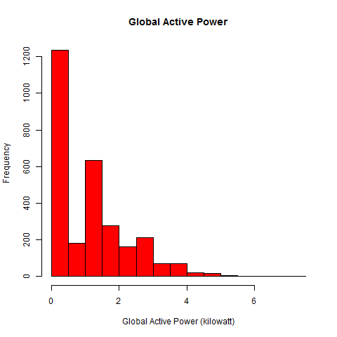
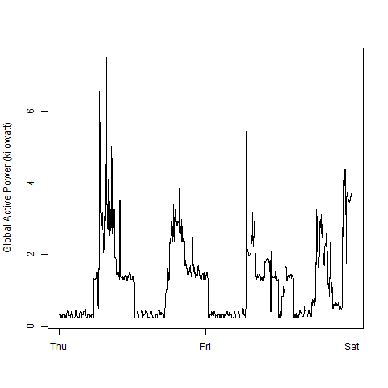
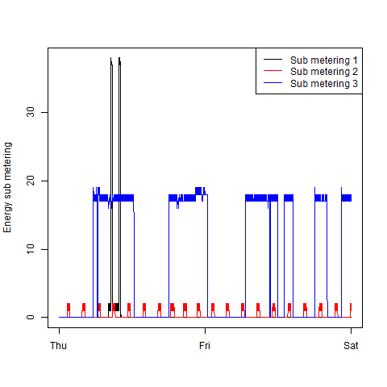
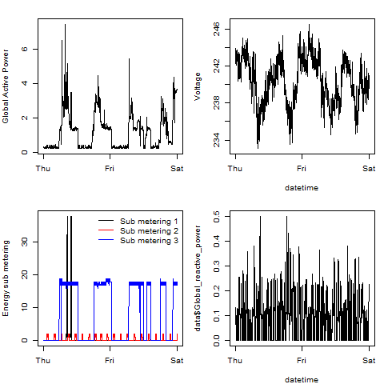

## Directories

This repository contains the following directories and files:
<ol>
<li> <b>figure</b>: png files of the plots 
  <ul>
		<li><b>plot1.png</b>: Picture of the first graph</li>
		<li><b>plot2.png</b>: Picture of the second graph</li>
		<li><b>plot3.png</b>: Picture of the third graph</li>
		<li><b>plot4.png</b>: Picture of the fourth graph</li>
	</ul>
<li> <b>Rscript</b>: R scripts used to load the data and generate the plots
	<ul>
		<li><b>Load_Data.R</b>: Function used to load and format the data in R</li>
		<li><b>plot1.R</b>: R script used generate the first graph</li>
		<li><b>plot1.R</b>: R script used generate the second graph</li>
		<li><b>plot1.R</b>: R script used generate the third graph</li>
		<li><b>plot1.R</b>: R script used generate the fourth graph</li>
	</ul>

## Loading the Data

The following function was used to load, subset and format the data into R:
```{r Plot1-Code,eval=FALSE}
  # This function will perfome the following actions
  # Download the zip file provided for the project and save it on the current working directory
  # Unzip the file to the current working directory and delete the zip file downloaded previously
  # Create an extra file in the current working directory containing only the records for the 02/01/2007 and 02/02/2007
  # Read the file created on the previous step into a data frame and add an additional field named Date_Time formatting 
    # the Date and Time columns into a POSIXLT Object
  # Finally return the dataset created on the previous step

getLines<-function(){
  # Load the stringr package
  require(stringr)
  # Download the zip file
  download.file('https://d396qusza40orc.cloudfront.net/exdata%2Fdata%2Fhousehold_power_consumption.zip',
                paste(getwd(),'household_power_consumption.zip',sep = '/'),quiet = T)
  # Unzip the file downloaded
  unzip('household_power_consumption.zip')
  file<-'household_power_consumption.txt'
  # Remove the zip file from the current working directory
  file.remove('household_power_consumption.zip')
  # Open a connection to the text file for reading
  con <- file(file, 'r')
  # Out file where the records from 02/01/2007 and 02/02/2007 are going to be writen
  outfile <- file(paste('subset',file,sep='_'), 'w')
  # Read the first line in the file for naming the fields or columns in the data frame unig the stringr package
  names<-str_split(readLines(file,1),';')[[1]]
  # Read the text file in chuncks of 1000 lines and write the lines to the outfile if Date of the line is either 2/1/2007 or 2/2/2007
  while (length(lines <- readLines(con, n=1000)) > 0){
    for (i in 1:length(lines)){
      if(grepl('^(1/2/2007|2/2/2007)',lines[i])){
        write(lines[i],outfile,append = TRUE)
      }
    }
  }
  # Close the connections to the files
  close(con)
  close(outfile)
  # Read in to data frame the out file containing the records of the desire dates
  data<-read.table('subset_household_power_consumption.txt',sep =';',header=FALSE,stringsAsFactors = FALSE,na.strings = '?',
                   colClasses = c(rep('character',2),rep('numeric',7)))
  # Assign the names of the fields to the data frame
  names(data)<-names
  # Format the date and time columns into a new column in the data frame
  data$Date_Time<-strptime(paste(data$Date,data$Time),'%d/%m/%Y %H:%M:%S')
  # Return the data frame
  return(data)
}
```

## First Graph



## Code to generate the first graph
```{r Code-Graph1,eval=FALSE}
# To load the function to read the data contained in the file
source('Rscript/Load_Data.R')
# Read the data, create a plot and save the plot to the figure directory

data<-getLines()
png('figure/plot1.png',480,480,'px')
  hist(data$Global_active_power,col='red',main='Global Active Power',xlab='Global Active Power (kilowatt)',ylab='Frequency')
dev.off()
```
## Second Graph



## Code to generate the second graph

```{r Code-Graph2,eval=FALSE}
  # To load the function to read the data contained in the file
  source('Rscript/Load_Data.R')
  # Read the data, create a plot and save the plot to the figure directory
  data<-getLines()
  png('figure/plot2.png',480,480,'px')
    with(data,plot(Date_Time,Global_active_power,type = 'l',ylab='Global Active Power (kilowatt)',xlab=''))
  dev.off()
```

## Third Graph



## Code to generate the third graph
```{r Code-Graph3,eval=FALSE}
# To load the function to read the data contained in the file
source('Rscript/Load_Data.R')
# Read the data, create a plot and save the plot to the figure directory
data<-getLines()
png('figure/plot3.png',480,480,'px')
  plot(data$Date_Time,data$Sub_metering_1,type = 'n',ylab='Energy sub metering',xlab='')
  lines(data$Date_Time,data$Sub_metering_1)
  lines(data$Date_Time,data$Sub_metering_2,col='red')
  lines(data$Date_Time,data$Sub_metering_3,col='blue')
  legend('topright',legend = c('Sub metering 1','Sub metering 2','Sub metering 3'),col=c('black','red','blue'),lty=1)
dev.off()
```

## Fourth Graph



## Code to generate the fourth graph
```{r Code-Graph4,eval=FALSE}
# To load the function to read the data contained in the file
source('Rscript/Load_Data.R')
# Read the data, create a plot and save the plot to the figure directory
data<-getLines()
png('figure/plot4.png',480,480,'px')
  marOriginal<-par('mar')
  par(mfrow=c(2,2),mar=c(4,4,2,1))
    plot(data$Date_Time,data$Global_active_power,xlab='',ylab='Global Active Power',type='l')
    plot(data$Date_Time,data$Voltage,ylab='Voltage',xlab='datetime',type='l')
    plot(data$Date_Time,data$Sub_metering_1,type = 'n',ylab='Energy sub metering',xlab='')
    lines(data$Date_Time,data$Sub_metering_1)
    lines(data$Date_Time,data$Sub_metering_2,col='red')
    lines(data$Date_Time,data$Sub_metering_3,col='blue')
    legend('topright',legend = c('Sub metering 1','Sub metering 2','Sub metering 3'),col=c('black','red','blue'),lty=1,bty = 'n')
    plot(data$Date_Time,data$Global_reactive_power,xlab='datetime',type='l')
  par(mfrow=c(1,1),mar=marOriginal)
dev.off()
```
